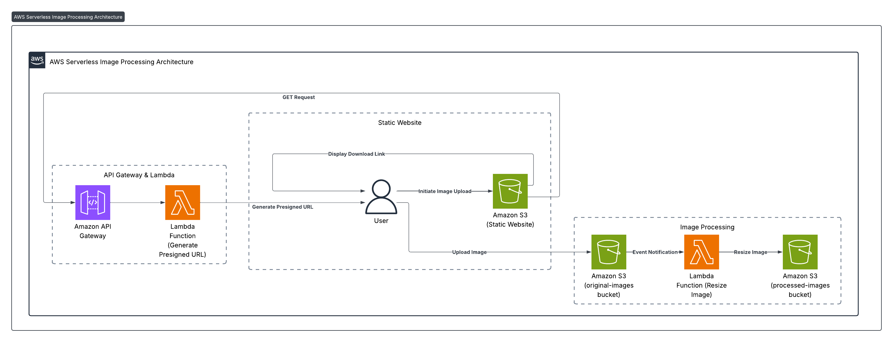

# Serverless Image Editor

This project is a **serverless image resizing web application** developed by **Karim Aql** as part of the **Manara Solution Architect course**.

## ✨ Features

- Upload any image from your device via the web interface
- Automatically resize images to a fixed width (preserving aspect ratio)
- Store original and processed images securely in Amazon S3
- Download the resized image directly from the web page
- Completely serverless architecture using AWS services

## 🏗️ Architecture

The project leverages the following AWS components:

- **Amazon S3**
  - Original images bucket
  - Processed images bucket
  - Static website hosting for the frontend
- **API Gateway**
  - REST API to generate presigned upload URLs
- **Lambda Functions**
  - Generate presigned POST URLs for uploading images
  - Process uploaded images (resize and save)
- **IAM**
  - Roles and policies granting Lambda access to S3
- **CORS configuration**
  - Allow cross-origin POST and GET requests to S3

## 🚀 How It Works

1. The user selects or drags an image file into the web app.
2. The frontend requests a presigned S3 URL via API Gateway.
3. The image is uploaded directly to the S3 original images bucket.
4. An S3 event triggers the Lambda processor function.
5. The Lambda resizes the image to a width of 500 pixels (JPEG), preserving aspect ratio.
6. The processed image is stored in the processed images bucket.
7. The frontend displays a download link for the resized image.

## 🖥️ Frontend

The static HTML/CSS/JavaScript frontend includes:

- Drag-and-drop image upload box
- Upload progress indicator
- Animated processing progress
- Display of resized image and download link
  

## 🛡️ Security

- S3 buckets have fine-grained permissions:
  - Only Lambda functions can write to the processed images bucket.
  - Public read access on processed images for download.
- Presigned URLs expire after 5 minutes.
- CORS is restricted to allow only necessary operations.

